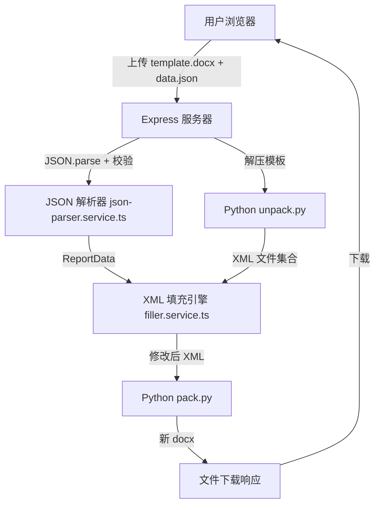

## 用户需求

构建一个基于 Web 的年度检查报告自动填充工具。用户通过浏览器上传 Word 模板文件（.docx）和 JSON 数据文件（.json），系统自动将数据填充到模板中，生成完整的 Word 报告供下载。

## 产品概述

面向年度检查报告编制场景，解决人工填写效率低、易出错的问题。用户只需准备一份 Word 模板和一份结构化 JSON 数据，系统自动完成占位符替换和表格数据填充。

## 核心功能

- **模板上传**：支持上传 .docx 格式模板，自动解压并识别占位符和表格结构
- **JSON 数据导入**：支持上传 .json 数据文件（用户自行准备），结构为 `{basicInfo: {...}, tables: [...]}`
- **智能填充**：文本占位符替换（正则扫描 `<w:t>` 节点）+ 表格数据行填充（表头匹配→逐行填入→自动追加行）
- **结果下载**：生成新 docx 文件供下载，原模板保持不变

## 技术栈选择

- **后端运行时**: Node.js 18+ + Express 4 + TypeScript
- **文件上传**: multer 中间件
- **JSON 解析**: Node.js 内置 `JSON.parse`，配合结构校验
- **Word 处理**: Python 脚本（docx skill 的 unpack/pack 工具链）直接操作 XML
- **前端**: 纯 HTML/CSS/JS 单页面，Fetch API 通信，无框架依赖

## 实现方案

### 整体架构



### 核心策略：XML 直接操作

**不使用 docx-js 重建**，因为模板是 WPS 创建的复杂文档（46 个 XML 文件），包含自定义命名空间、复杂表格、页眉页脚。直接编辑 XML 可完整保留原始格式。

### 填充两阶段

**阶段一：文本占位符替换** — 扫描 `document.xml` 所有 `<w:t>` 节点，按映射表精确替换：

| 占位符模式 | 替换来源 |
| --- | --- |
| `XXXXX-XXXX-XXXX-202X` | basicInfo.reportNumber |
| `XXXXXXXXXXXX` | basicInfo.deviceName |
| `XXXXXXX公司` | basicInfo.companyName |
| `XXXXXXXXX/XXXXXXXX/XXXXX/XXXXXX` | basicInfo.reportTypePrefix |
| `202X年6月-202X年7月` | inspectionStartDate + inspectionEndDate |
| `202X年X月XX日` | inspectorDate / checkerDate / reviewerDate |


**阶段二：表格数据填充** — 遍历 `<w:tbl>` 元素，按表头关键词匹配 JSON tables 数组，逐行填入空 `<w:tc>` 单元格。若 JSON 行数超过模板预留空行，自动追加新行。

### 性能考虑

- 模板缓存：首次解压后缓存，同模板复用
- XML 操作使用正则批量替换 + 行级扫描
- 临时文件 1 小时 TTL 自动清理

## 目录结构

```
c:/Users/Administrator/CodeBuddy/报告生成/
├── server/
│   ├── package.json              # [NEW] express, multer, typescript, ts-node-dev
│   ├── tsconfig.json             # [NEW] TypeScript 配置
│   ├── src/
│   │   ├── index.ts              # [NEW] Express 入口：中间件、路由注册、静态服务、端口3000
│   │   ├── routes/
│   │   │   └── api.ts            # [NEW] API 路由：上传模板、上传JSON、执行填充、下载结果
│   │   ├── services/
│   │   │   ├── json-parser.service.ts  # [NEW] JSON 解析与校验：读取上传的.json，验证结构完整性
│   │   │   ├── docx.service.ts         # [NEW] docx 操作：调用Python unpack/pack，管理临时文件和缓存
│   │   │   └── filler.service.ts       # [NEW] 填充引擎：占位符映射表、文本替换、表格填充、行追加
│   │   └── types/
│   │       └── index.ts                # [NEW] ReportData, TableData, FillResult, PlaceholderMapping
│   ├── uploads/                  # [NEW] 上传临时目录
│   └── output/                   # [NEW] 生成文件输出目录
├── public/
│   ├── index.html                # [NEW] 主页面
│   ├── css/
│   │   └── style.css             # [NEW] 蓝白卡片布局、拖拽上传、动画
│   └── js/
│       ├── main.js               # [NEW] 页面初始化、事件绑定、状态管理
│       ├── upload.js             # [NEW] 拖拽上传、文件校验、进度展示
│       └── api.js                # [NEW] Fetch API 封装、错误处理
└── CODEBUDDY.md                  # [MODIFY] 更新：Excel→JSON，移除xlsx依赖说明
```

## 关键代码结构

### 类型定义 (server/src/types/index.ts)

```typescript
interface BasicInfo {
  reportNumber: string;
  companyName: string;
  deviceName: string;
  reportTypePrefix: string;
  inspectionStartDate: string;
  inspectionEndDate: string;
  inspectorDate: string;
  checkerDate: string;
  reviewerDate: string;
}

interface TableData {
  sheetName: string;
  headers: string[];
  rows: string[][];
}

interface ReportData {
  basicInfo: BasicInfo;
  tables: TableData[];
}

interface FillResult {
  success: boolean;
  outputPath: string;
  warnings: string[];
  replacedCount: number;
  filledRowsCount: number;
}
```

### API 路由

| Method | Endpoint | Purpose |
| --- | --- | --- |
| POST | `/api/upload/template` | 上传 Word 模板 (.docx) |
| POST | `/api/upload/json` | 上传 JSON 数据文件 (.json) |
| POST | `/api/fill` | 执行填充（需已上传模板+JSON） |
| GET | `/api/download/:filename` | 下载生成报告 |


## 设计风格

采用现代简约专业风格，蓝白配色（主色 #2563EB），营造企业级工具型产品氛围。页面居中卡片式布局，上传区使用虚线边框 + 拖拽交互，填充进度使用动画进度条，整体视觉效果干净利落。

## 页面结构（从上到下）

### 1. 顶部导航栏

- 左侧：应用名称「年度检查报告自动填充工具」，蓝色渐变文字
- 右侧：无额外按钮（已移除 Excel 模板下载）

### 2. 上传区域（双卡片并排）

- 左卡片：Word 模板上传区，虚线边框，文档图标 + 「点击或拖拽上传 .docx 模板」提示
- 右卡片：JSON 数据上传区，虚线边框，代码图标 + 「点击或拖拽上传 .json 数据」提示
- 两卡片间「+」蓝色圆形连接符
- 上传后显示文件名和大小，可删除重传

### 3. 数据预览区

- JSON 上传后自动展示：代码块预览（灰底等宽字体，显示 basicInfo 关键字段和 tables 统计）
- 各 table 的 sheetName + 行数统计

### 4. 操作按钮区

- 「开始填充」主按钮（蓝色填充 #2563EB，圆角，微阴影）
- 「重置」次按钮（灰色边框 #64748B）
- 处理状态文字（"正在解析模板..." → "正在填充数据..." → "正在打包文档..."）

### 5. 结果区

- 成功：绿色图标 + 统计摘要（替换占位符数 / 填充表格数 / 插入行数）
- 「下载报告」按钮（绿色 #10B981，突出显示）
- 失败：红色警告 + 错误详情

## 交互细节

- 拖拽上传时虚线边框变蓝色实线 + 淡蓝背景高亮
- 按钮 hover 微上移 + 阴影加深
- 填充中显示步骤动画进度条
- 响应式布局，小屏卡片上下排列

## Agent Extensions

### Skill

- **docx**
- 用途：提供 Python unpack/pack 工具链，用于解压 .docx 模板为可编辑 XML、修改后重新打包为有效 docx
- 预期结果：模板成功解压为 XML 文件集合；修改后 XML 成功打包为可在 Word/WPS 中正常打开的新 docx，格式完整保留

- **frontend-design**
- 用途：生成高质量前端页面代码（HTML/CSS/JS），包含上传区域、数据预览、进度动画、结果展示等完整交互
- 预期结果：产出视觉精美、交互流畅的单页面 Web 应用，蓝白配色卡片布局，可直接用于生产环境

### SubAgent

- **code-explorer**
- 用途：在开发填充引擎阶段，深度分析解压后的模板 XML 文档树，定位占位符精确位置和表格结构
- 预期结果：输出占位符精确 XML 路径清单 + 表头到列索引映射表 + 空数据行定位规则