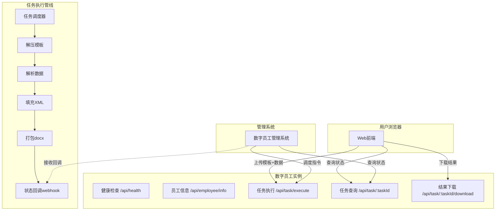
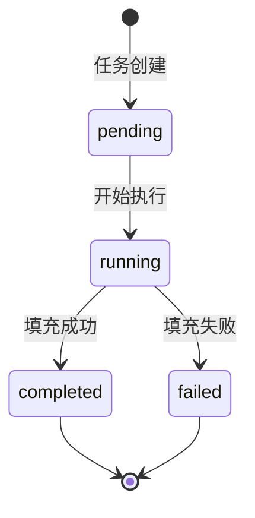

## 产品概述

「年度检查报告自动填充」是一款数字员工产品，面向特种设备定期检验场景，解决人工编制年度检查报告效率低、易出错的问题。用户上传 JSON/YAML 数据文件和 .docx 模板后，系统自动完成数据填充并生成完整报告。产品作为标准化数字员工，提供全套纳管接口供数字员工管理系统统一调度。

## 核心功能

### 业务功能

- **数据导入**：上传 JSON 或 YAML 格式的结构化数据文件，系统自动解析、校验数据完整性，支持在线预览数据内容
- **模板导入**：上传 .docx 格式的年度检查报告模板，系统自动解压并分析占位符和表格结构，缓存解析结果
- **数据填充**：将解析后的 JSON 数据精确填入 Word 模板 —— 基本信息替换顶层占位符（报告编号、单位名称、设备名称、检验日期范围、签名日期等），检测数据逐行填充到对应表格的空白单元格
- **在线预览与下载**：填充完成后展示统计摘要（替换占位符数量、填充表格数量、插入数据行数），一键下载生成的新 docx 文件，原模板不受影响

### 数字员工纳管接口

| 接口 | 路径 | 说明 |
| --- | --- | --- |
| 健康检查 | `GET /api/health` | 返回运行状态、内存/CPU 使用、运行时间 |
| 身份信息 | `GET /api/employee/info` | 返回员工名称、ID、版本号、能力描述、支持格式 |
| 任务执行 | `POST /api/task/execute` | 接收管理系统调度指令，异步执行填充任务 |
| 任务查询 | `GET /api/task/:taskId` | 查询任务状态（pending / running / completed / failed）及结果 |
| 结果下载 | `GET /api/task/:taskId/download` | 下载已完成任务的 docx 输出文件 |
| 状态回调 | webhook | 任务终态时向配置的回调地址发送通知 |


## 技术栈选择

- **运行时**：Node.js 18+ + Express 4 + TypeScript
- **Word 处理**：docx skill 的 Python unpack/pack 工具链，直接操作底层 XML（保留 WPS 原始格式）
- **数据解析**：JSON 原生 `JSON.parse`，YAML 使用 `js-yaml`
- **任务管理**：内存 Map 管理任务状态（预留 Redis 扩展接口）
- **前端**：纯 HTML/CSS/JS + Tailwind CSS CDN，无框架依赖
- **文件处理**：multer 处理上传，uuid 生成唯一标识

## 实现方案

### 整体架构



### 核心策略

**方案选择：XML 直接操作**

模板是 WPS 创建的复杂文档（46 个 XML 文件，48000 行），包含 `wpsCustomData` 命名空间、复杂表格合并、分节符、页眉页脚。直接编辑 XML 可完整保留原始格式，避免 docx-js 重建造成的格式丢失。

**填充两阶段策略：**

1. **文本占位符阶段**：扫描 `document.xml` 中所有 `<w:t>` 节点，按映射表精确替换
2. **表格数据阶段**：遍历 `<w:tbl>` 元素，匹配表头后逐行填入数据单元格的 `<w:t>`

**占位符映射表：**

| 占位符 | 替换来源 | 替换方式 |
| --- | --- | --- |
| `XXXXX-XXXX-XXXX-202X` | `basicInfo.reportNumber` | 精确文本替换 |
| `XXXXXXXXXXXX` | `basicInfo.deviceName` | 精确文本替换 |
| `XXXXXXX公司` | `basicInfo.companyName` | 精确文本替换 |
| `XXXXXXXXX` / `XXXXXXXX` 等 | `basicInfo.reportTypePrefix` | 按长度匹配替换 |
| `202X年6月-202X年7月` | `startDate + endDate` | 日期范围拼接替换 |
| `202X年X月XX日` | `inspectorDate / checkerDate` | 签名日期替换 |
| `202X` + 分散 `X` + `XX` | `reviewerDate` | 多 run 联合替换 |


### 数据校验规则

- `basicInfo` 字段完整性检查（9 个必填字段）
- `tables[]` 中每个 table 必须有 `tableName` 和 `headers`
- 日期格式统一为 `YYYY年M月D日`
- 报告编号格式为 `XXXXX-XXXX-XXXX-20XX`

### 任务状态机



### 性能考虑

- 模板解压结果按 session 缓存，避免重复解压
- XML 修改使用正则批量替换 + 行级扫描，避免全文件读入
- 临时文件超时自动清理（1 小时 TTL）
- 生成文件名使用 UUID，避免并发冲突

## 目录结构

```
c:/Users/Administrator/CodeBuddy/20260627103942/
├── server/
│   ├── package.json              # [NEW] 项目配置，express / multer / js-yaml / uuid / typescript
│   ├── tsconfig.json             # [NEW] TypeScript 编译配置
│   ├── src/
│   │   ├── index.ts              # [NEW] 服务入口：注册中间件、路由、端口监听（默认3100）
│   │   ├── config.ts             # [NEW] 全局配置：端口、上传目录、回调地址、清理策略、回调密钥
│   │   ├── routes/
│   │   │   ├── api.ts            # [NEW] 业务 API：upload-template / upload-data / fill / download / template
│   │   │   └── employee.ts       # [NEW] 纳管 API：health / employee-info / task-execute / task-status / task-download
│   │   ├── services/
│   │   │   ├── template.service.ts  # [NEW] 模板管理：接收上传、调用 unpack 解压、缓存路径、定位占位符和表头
│   │   │   ├── data.service.ts      # [NEW] 数据解析服务：JSON.parse / yaml.load，校验 ReportData 结构完整性
│   │   │   ├── filler.service.ts    # [NEW] 填充引擎：占位符映射替换 + 表格行列匹配填充 + 多run联合替换
│   │   │   ├── docx.service.ts      # [NEW] docx 操作：调用 Python unpack/pack 脚本，管理临时目录和清理
│   │   │   └── task.service.ts      # [NEW] 任务管理：创建任务、状态流转、异步执行、webhook 回调通知、TTL 清理
│   │   ├── utils/
│   │   │   ├── template-generator.ts # [NEW] 数据模板生成器：生成标准 JSON 和 YAML 模板（含完整字段和示例）
│   │   │   └── logger.ts            # [NEW] 日志工具：控制台输出 + 任务执行日志记录
│   │   └── types/
│   │       └── index.ts             # [NEW] 类型定义：ReportData, BasicInfo, TableData, TaskInfo, TaskStatus, EmployeeInfo, HealthStatus, FillResult
│   ├── uploads/               # [NEW] 上传文件临时存储
│   ├── output/                # [NEW] 生成 docx 输出目录
│   └── sessions/              # [NEW] 模板解压缓存目录（按 session ID 分文件夹）
├── public/
│   ├── index.html             # [NEW] 主页面：产品标题、双卡片上传区、数据预览、任务进度、结果展示
│   ├── css/
│   │   └── style.css          # [NEW] 样式：Tailwind CDN + 自定义设计变量，蓝白配色，卡片布局，动画
│   └── js/
│       ├── main.js            # [NEW] 主逻辑：页面初始化、全局状态管理、事件绑定
│       ├── upload.js          # [NEW] 上传模块：拖拽上传、文件校验(.docx/.json/.yaml/.yml)、进度展示
│       ├── preview.js         # [NEW] 预览模块：JSON 数据预览、表格数据概览、占位符预览
│       └── api.js             # [NEW] API 调用：封装 fetch 请求，统一错误处理、状态轮询
└── scripts/
    └── setup.bat              # [NEW] 一键安装脚本：cd server && npm install && npm run build
```

## 关键代码结构

### 类型定义 (types/index.ts)

```typescript
// 员工信息
interface EmployeeInfo {
  employeeId: string;           // "annual-report-filler-001"
  employeeName: string;         // "年度检查报告自动填充"
  version: string;              // "1.0.0"
  capabilities: string[];       // ["年度检查报告自动填充", "docx模板解析", "JSON/YAML数据填充"]
  supportedFormats: {
    templates: string[];        // [".docx"]
    data: string[];             // [".json", ".yaml", ".yml"]
  };
  callbackUrl?: string;         // 可配置的状态回调地址
}

// 健康状态
interface HealthStatus {
  status: "healthy" | "degraded" | "unhealthy";
  uptime: number;               // 运行秒数
  memoryUsage: { heapUsed: number; heapTotal: number };
  activeTaskCount: number;
  completedTaskCount: number;
}

// 任务状态枚举
type TaskStatus = "pending" | "running" | "completed" | "failed";

// 任务信息
interface TaskInfo {
  taskId: string;
  status: TaskStatus;
  createdAt: string;
  updatedAt: string;
  input?: { templateName: string; dataFileName: string; recordCount: number };
  result?: FillResult;
  error?: string;
}

// 填充结果
interface FillResult {
  success: boolean;
  outputFileName: string;
  downloadUrl: string;
  stats: { placeholdersReplaced: number; tablesFilled: number; rowsInserted: number };
  warnings: string[];
}
```

### API 详细设计

**业务 API（`routes/api.ts`）：**

| 方法 | 路径 | 说明 |
| --- | --- | --- |
| POST | `/api/upload-template` | 上传 .docx 模板，返回 templateSessionId |
| POST | `/api/upload-data` | 上传 .json/.yaml，解析并返回数据预览 |
| POST | `/api/fill` | 同步填充（传入 sessionId + data），返回 FillResult |
| GET | `/api/download/:fileId` | 下载生成的 docx |
| GET | `/api/template/:format` | 下载数据模板（format: json / yaml） |


**纳管 API（`routes/employee.ts`）：**

| 方法 | 路径 | 说明 |
| --- | --- | --- |
| GET | `/api/health` | 健康检查，返回 HealthStatus |
| GET | `/api/employee/info` | 返回 EmployeeInfo 元信息 |
| POST | `/api/task/execute` | 接收管理系统调度，入参含模板+数据，异步执行 |
| GET | `/api/task/:taskId` | 查询任务状态和结果 |
| GET | `/api/task/:taskId/download` | 下载任务产出的 docx |


## 设计风格

采用现代简约专业风格，适配企业级数字员工管理场景。以蓝白配色为主调，营造可信赖的工具型产品氛围。页面采用卡片式居中布局，上传区域使用虚线边框结合拖拽交互，任务状态使用动态步骤指示器，整体视觉效果干净利落、精致专业。

## 页面规划

本产品为单页面工具，包含以下功能区块：

### 1. 顶部导航栏

- 左侧品牌标识：「年度检查报告自动填充」+ 数字员工徽章标签
- 右侧「下载数据模板」按钮组（JSON / YAML），蓝色边框幽灵按钮，hover 填充

### 2. 上传区域（双卡片并排）

- 左卡片：Word 模板上传区，文件图标 + 「点击或拖拽上传 .docx 模板」提示，虚线边框
- 右卡片：JSON/YAML 数据上传区，代码图标 + 「点击或拖拽上传 .json / .yaml 数据」提示
- 两卡片间「+」圆形蓝色连接符
- 上传后卡片切换为「已就绪」状态，显示文件名和大小，可删除

### 3. 数据预览区

- JSON 代码块预览（灰色背景，等宽字体，语法高亮显示 basicInfo 关键字段）
- 表格数据概览（各 table 名称 + 行数统计，浅蓝底色小卡片排列）

### 4. 任务控制区

- 「提交任务」主按钮（蓝色填充，微阴影，hover 加深）
- 「重置」次按钮（灰色边框）
- 任务 ID 展示标签
- 三步进度条动画：数据解析 → 模板匹配 → 填充打包

### 5. 结果展示区

- 成功：绿色勾选图标 + 统计摘要（替换数 / 表格数 / 行数）+ 「下载报告」按钮
- 失败：红色警告图标 + 错误详情

## 交互细节

- 拖拽上传时虚线边框变为蓝色实线 + 淡蓝背景
- 进度条使用渐变色填充动画
- 按钮 hover 时微上移 + 阴影加深
- 响应式布局，小屏卡片上下排列

## 使用的 Agent 扩展

### Skill

- **docx**
- 用途：提供 Word 文档的 Python unpack/pack 工具链（位于 `C:\Users\Administrator\.claude\skills\docx\scripts\office\`），用于解压模板为可编辑 XML、修改后重新打包为有效 docx。同时用于最终生成文件的格式验证。
- 预期结果：模板解压为文档集合，修改后成功打包为新 docx；生成文件在 Word/WPS 中格式完整保留。

- **frontend-design**
- 用途：按照产品级标准生成前端 HTML/CSS/JS 代码，包含上传区域、数据预览、任务状态动画、结果展示等完整交互。
- 预期结果：产出视觉精美、交互流畅的单页面 Web 应用，可直接用于生产环境。

### SubAgent

- **code-explorer**
- 用途：深度分析解压后的模板 XML 文档树，定位所有占位符的精确 XML 路径（含所在 `<w:r>` 行号）、表格的列结构、表头文本列表，为填充引擎提供精确的定位信息。
- 预期结果：输出占位符精确位置清单 + 表头到列索引的映射表 + 空数据行定位规则。