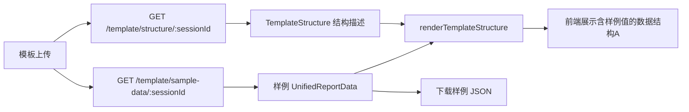

## 用户需求

基于已提取的模板数据结构A（TemplateStructure），自动生成符合格式的模拟样例数据，填入数据结构A展示区，并将样例数据生成为可下载的 JSON 文件。

## 产品概述

在现有"模板数据结构A"展示区基础上，用真实的模拟样例数据替换当前的"待填入"和"行数据"占位文字，让用户直观看到模板期望的数据格式和内容示例。同时提供下载按钮，将样例数据导出为 JSON 文件供数据准备阶段参考。

## 核心功能

- 生成样例数据：后端根据模板结构（BasicInfo字段 + 键值对表标签 + 列表型表列名 + 签名行字段）自动生成符合类型语义的模拟数据
- **签名行内容提取**：从列表型表最后一行提取签名行字段标签（"检测人："、"校核人："、"审定人："及其日期），纳入数据结构A描述
- 前端展示填充效果：KV表格的"待填入"替换为真实样例值（如设备名称→压力管道A-001），列表型表格展示2-3行模拟数据行，签名行显示样例签名数据
- 下载样例JSON：新增按钮下载包含完整样例数据的 JSON 文件，用户可直接用作数据模板参考
- 与现有下载JSON按钮区分：原按钮下载模板结构定义，新按钮下载含样例数据的填充结果

## 技术方案

### 实现策略

在后端新增 `GET /api/template/sample-data/:sessionId` 接口，基于 TemplateStructure 生成样例 UnifiedReportData。前端修改 `renderTemplateStructure()` 同时接收结构描述和样例数据，将"待填入"/"行数据"替换为真实样例值。HTML 新增"下载样例JSON"按钮，与原"下载JSON"按钮并列。

### 关键设计决策

1. **样例数据生成放在后端**：利用 TypeScript 类型系统确保生成数据符合 UnifiedReportData 格式，便于后续校验引擎直接消费
2. **前后端数据结构对齐**：样例数据直接使用 UnifiedReportData 格式（basicInfo + sections），前端渲染时按结构描述和样例数据匹配显示
3. **不修改 renderTemplateStructure 签名**：新增可选的 sampleData 参数，未传入时保持原"待填入"占位行为
4. **字段语义感知生成**：根据 fieldName 推断合理样例值（reportNumber→生成编号格式，companyName→公司名，deviceName→设备名，日期→合理日期）
5. **签名行内容提取**：在 `analyze()` 中提取列表型表最后一行的文本标签作为签名字段名（检测人/校核人/审定人+日期），存入 `TemplateSection.signatureFields`；模板结构JSON中输出 `signatureFields` 数组

### 性能考量

- 样例数据生成是纯字符串拼接，无 I/O 调用，O(n) 复杂度（n=表格数+列数），单次调用耗时<5ms
- 前端渲染单个结构卡片，28张表格+4字段，预估DOM节点约500个，无性能瓶颈

### 防回归

- `renderTemplateStructure(desc)` 无 sampleData 参数时保持原行为
- 原下载JSON按钮（下载结构定义）不受影响
- 模板上传/填充/下载流程不被修改

## 架构设计



## 目录结构

```
报告生成/
├── server/src/
│   ├── routes/
│   │   └── api.ts                    # [MODIFY] 新增 GET /api/template/sample-data/:sessionId 路由
│   └── services/
│       └── template-analyzer.service.ts  # [MODIFY] analyze() 提取签名行字段标签 + 新增 generateSampleData()
├── public/
│   ├── index.html                    # [MODIFY] 新增"下载样例JSON"按钮
│   ├── js/
│   │   ├── api.js                    # [MODIFY] 新增 getTemplateSampleData + downloadTemplateSampleData
│   │   ├── main.js                   # [MODIFY] renderTemplateStructure 新增 sampleData 参数
│   │   └── upload.js                 # [MODIFY] 模板上传后同时 fetch 样例数据
│   └── css/
│       └── style.css                 # [MODIFY] 新增样例值文本样式
```

## 关键代码结构

### 样例数据生成逻辑（template-analyzer.service.ts 新增）

```typescript
generateSampleData(structure: TemplateStructure): UnifiedReportData
```

按 fieldName 语义生成样例值：

- reportNumber → "GGA-2025-03001-2025"
- companyName → "XX管道有限公司"
- deviceName → "压力管道A-001"
- inspectionStartDate → "2025年6月"
- inspectionEndDate → "2025年7月"
- inspectorDate/checkerDate/reviewerDate → "2025年7月15日"
- KV表标签 → 根据标签语义生成对应值（如"外径"→"508mm"，"壁厚"→"12.5mm"）
- 列表表 → 根据列名生成2行模拟数据
- 签名行 → inspectorName:"张工"、checkerName:"李工"、reviewerName:"王主任"、日期均用 inspectionEndDate 即"2025年7月"

### 签名行提取逻辑（template-analyzer.service.ts analyze() 内）

```typescript
// 对每个列表型表格，提取最后一行文本作为签名字段标签
const lastTrRegex = /<w:tr[ >]/g;
let lastTrMatch: RegExpExecArray | null;
let lastTr: string | null = null;
while ((lastTrMatch = lastTrRegex.exec(tbl)) !== null) {
  lastTr = extractTagContent(tbl, lastTrMatch.index, "w:tr");
}
// 从最后一行提取单元格文本作为签名字段名
const sigLabels = lastTr ? getCellMergedTexts(lastTr).filter(t => t && t.length < 20) : [];
// 存入 signatureFields，如 ["检测人：", "校核人：", "审定人：", "日期：", "日期：", "日期："]
sections.push({
  ...
  signaturePosition: { tableIndex: tblIdx },
  signatureFields: sigLabels,
});
```

对应的 `TemplateSection` 类型扩展：

```typescript
export interface TemplateSection {
  ...
  signaturePosition: { tableIndex: number } | null;
  signatureFields?: string[];  // 新增：签名行文本标签列表
}
```

### 模板结构JSON中签名行输出格式

```
{
  "signatureRow": {
    "hasSignature": true,
    "labels": ["检测人：", "", "校核人：", "", "审定人：", "", "日期：", "日期：", "日期："]
  }
}
```

### API 响应格式

```typescript
// GET /api/template/sample-data/:sessionId?download=1
{
  "success": true,
  "data": {
    "basicInfo": { "reportNumber": "GGA-2025-03001-2025", ... },
    "sections": [
      {
        "id": "table_0",
        "title": "表格区域 table_0",
        "kvPairs": [{ "key": "设备名称", "value": "压力管道A-001" }, ...],
        "tables": [{ "tableType": "DataRecord", "headers": ["序号","检测项目"], "rows": [...] }],
        "signature": { "inspectorName": "张工", "inspectorDate": "2025年7月15日", ... }
      }
    ]
  }
}
```