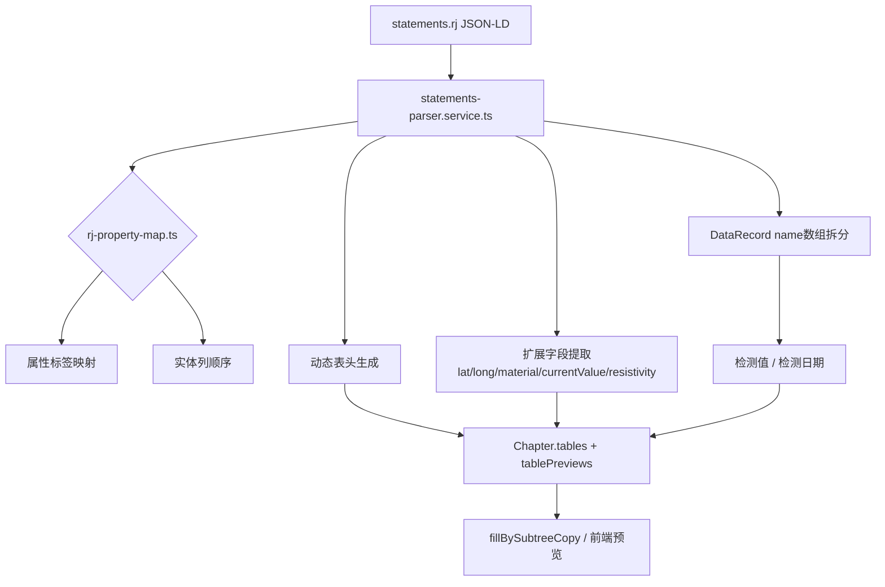

## 用户需求

用户补充了《年度检查报告本体 V1.0》（.ttl）和《年度检查报告本体说明书》（.docx），要求分析这些定义说明文档后，更新数据获取的实现，使 `.rj` 知识图谱和 `.docx` 源文档中提取的字段与本体的数据定义对齐。

## 核心功能

- **基于本体的属性语义映射**：将 `.rj` 中 `http://example.org/report#` 的英文/拼音属性名，映射到本体中定义的中文数据属性标签（如 `burialDepth`→`埋深`、`location`→`位置`、`resistivity`→`土壤电阻率`）。
- **动态表头生成**：`statements-parser` 不再使用硬编码的 7 组表头，而是根据实体类型和该类型实际存在的属性生成表头。
- **扩展字段提取**：覆盖 `.rj` 中实际出现的 `latitude`、`longitude`、`material`、`currentValue`、`resistivity` 等属性；`DataRecord` 的 `name` 数组拆分为“检测值”和“检测日期”。
- **数据模板同步**：`template-generator.ts` 的示例数据增加本体相关字段。
- **.docx 源文档提取增强**：`chapter-extractor` 的表格预览继续准确提取表头，并保留与本体语义一致的中文列名。

## 技术栈

- 后端：Node.js + Express + TypeScript
- 数据解析：原生 JSON.parse（.rj）、正则/XML 提取（.docx）
- 本体参考：年度检查报告本体 V1.0.ttl（OWL/Turtle），手动解析为 TypeScript 映射表

## 实现方法

1. 新建 `server/src/utils/rj-property-map.ts`，集中维护 `.rj` 属性 → 中文标签、各实体类型推荐列顺序的映射。
2. 重写 `statements-parser.service.ts` 的表头和单元格生成逻辑：

- 以 `RJ_ENTITY_COLUMNS` 为基准列顺序；
- 对每条记录只取实际存在的属性生成单元格；
- 同章节同类型的记录合并表头（取并集），保持列对齐。

3. `DataRecord` 特殊处理：将 `name` 数组的第一个值作为“检测值”，第二个值作为“检测日期”。
4. `chapter-extractor.service.ts` 的 `buildTablePreviews` 保持不变，因为它已经按 `<w:tc>` 提取单元格文本；如需语义增强后续可再扩展。
5. 更新 `template-generator.ts`，使 JSON/YAML 模板示例包含位置、埋深、材质、电流值、土壤电阻率、检测日期等字段。
6. 编译验证后启动服务测试。

## 性能与可维护性

- 映射表集中管理，新增属性只需改一处。
- 动态表头避免硬编码带来的遗漏，复杂度 O(n×m)，n 为记录数、m 为属性数，可接受。
- 保留原有 `.rj` 解析流程，不破坏现有 `fillBySubtreeCopy` 调用链。

## 架构设计

## Agent Extensions

- **code-explorer**（SubAgent）
- 用途：在实现前再次确认 `.rj` 属性全集、`fillBySubtreeCopy` 消费 `Chapter.tables` 的方式、以及 `template-generator.ts` 的调用点。
- 预期结果：明确需要修改的文件边界，避免破坏现有填充逻辑。