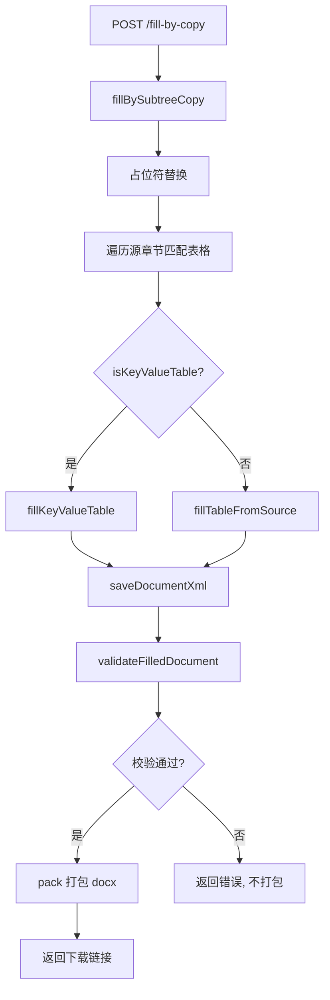

## 需求

在现有 fill-by-copy 填充流程中增加格式校验环节：

1. 键值对型表格按现有逻辑写入模板
2. 列表型表格根据表头匹配写入模板
3. 写入完成后，校验新文件与模板文件的格式一致性
4. 校验通过后才允许下载

## 核心功能

- **XML 结构校验**：验证填充后 document.xml 的表格标签闭合、行列结构完整
- **docx 完整性校验**：验证 [Content_Types].xml、rels 等关键文件存在
- **表格一致性对比**：填充前后的表格数量、列数不变，行数只增不减
- **前端校验反馈**：校验失败时显示错误信息，阻止下载按钮显示

## 技术方案

### 新增文件：`server/src/utils/xml-validator.ts`

校验工具模块，输出三个校验函数和一个聚合入口：

```typescript
interface ValidationResult {
  valid: boolean;
  errors: string[];
  warnings: string[];
}

// 校验 XML 语法和表格结构完整性
function validateDocumentXml(xml: string): ValidationResult

// 校验 docx 解压目录结构完整性
function validateStructureIntegrity(unpackDir: string): ValidationResult

// 对比填充前后表格数量、行列一致性
function compareTableStructure(beforeXml: string, afterXml: string): ValidationResult

// 聚合校验入口
function validateFilledDocument(beforeXml: string, afterXml: string, unpackDir: string): ValidationResult
```

**validateDocumentXml 实现要点**：

- 提取所有 `<w:tbl>` 标签，用 `extractTagContent` 验证每对开闭标签匹配
- 每个 `<w:tbl>` 内部至少包含 1 个 `<w:tr>`
- 每个 `<w:tr>` 内部至少包含 1 个 `<w:tc>`
- 检查 `<w:tc>` 开闭标签数量匹配（`<w:tc` vs `</w:tc>`）

**compareTableStructure 实现要点**：

- 统计 `<w:tbl>` 数量，before 和 after 必须相等
- 对每个表格，统计 `<w:tr>` 数量：after >= before（允许追加数据行）
- 对每个表格第一行，统计 `<w:tc>` 数量：after === before（列结构不变）
- 不匹配时给出精确错误信息（哪个表格、哪个指标不匹配）

### 修改文件：`server/src/services/filler.service.ts`

在 `fillBySubtreeCopy()` 第 201 行 `saveDocumentXml` 之后，插入校验：

```typescript
// 5. 保存修改后的 XML
await templateService.saveDocumentXml(templateSessionId, xml);

// 5.5 格式校验
const templateEntry = templateService.getSession(templateSessionId);
if (templateEntry && templateEntry.originalXml) {
  const validation = validateFilledDocument(
    templateEntry.originalXml, xml, templateEntry.unpackDir
  );
  if (!validation.valid) {
    logger.error(`格式校验失败: ${validation.errors.join("; ")}`);
    stats.validationPassed = false;
    return {
      fillResult: {
        success: false,
        outputFileName: "",
        downloadUrl: "",
        stats: { ...stats, tablesFilled: 0, rowsInserted: 0 },
        warnings: [...warnings, ...validation.errors],
        error: `格式校验失败: ${validation.errors[0]}`,
      },
      subtreeStats: stats,
    };
  }
  stats.validationPassed = true;
  logger.info("格式校验通过");
}
```

需要在 `TemplateSession` 类型中存储原始 XML 快照，在 `templateService` 的 upload 阶段保存。

### 修改文件：`server/src/services/template.service.ts`

在模板上传解压后，读取原始 `document.xml` 并存储到 session 中：

```typescript
// 在 upload/analyze 流程中新增
const originalXml = await fs.readFile(
  path.join(unpackDir, 'word', 'document.xml'), 'utf-8'
);
// 存储到 session 对象中
session.originalXml = originalXml;
```

### 修改文件：`server/src/types/index.ts`

```typescript
// SubtreeStats 新增字段
export interface SubtreeStats {
  // ... 现有字段 ...
  validationPassed: boolean;
}

// FillResult 新增可选字段
export interface FillResult {
  // ... 现有字段 ...
  validation?: {
    passed: boolean;
    errors: string[];
  };
}
```

### 修改文件：`server/src/routes/api.ts`

第 244-247 行响应中，`fillResult` 已通过类型传递 `validation` 信息，无需额外改动。校验失败时 `fillResult.success = false`，前端根据此判断。

### 修改文件：`public/js/main.js`

在结果展示函数中，增加校验状态判断：

```javascript
// 在 fillResult 处理中
if (result.data.fillResult.validation) {
  if (result.data.fillResult.validation.passed) {
    // 显示绿色"格式校验通过" + 下载按钮
  } else {
    // 显示红色错误信息，隐藏下载按钮
  }
}
```

## 架构设计



## 目录结构

```
server/src/
├── utils/
│   ├── xml-utils.ts          # 现有工具（不改）
│   └── xml-validator.ts      # [NEW] 格式校验模块
├── services/
│   ├── filler.service.ts     # [MODIFY] 第201行后插入校验
│   └── template.service.ts   # [MODIFY] 存储原始XML快照
├── types/
│   └── index.ts              # [MODIFY] SubtreeStats/FillResult 扩展
└── routes/
    └── api.ts                # 无需改动（FillResult已包含validation）

public/js/
└── main.js                   # [MODIFY] 结果展示增加校验状态
```