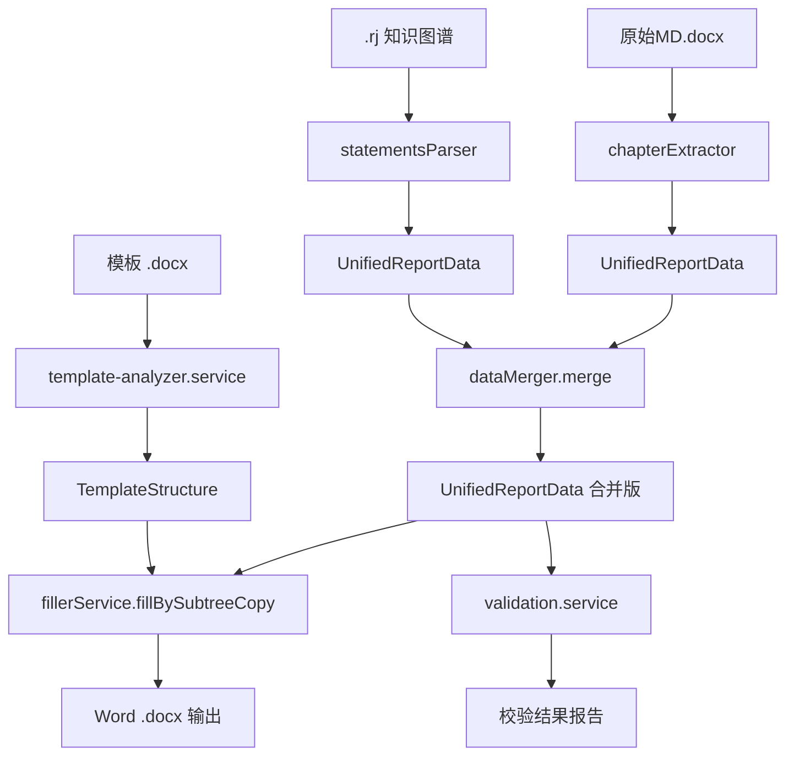

## 产品概述

将年度检查报告自动填充系统的数据流重构为**统一中间数据结构 A（UnifiedReportData）**，实现模板分析、取数、填数、校验四个环节共享同一份纯数据层结构，消除当前 SourceAnalysis/Chapter 中混杂 Word XML 片段的问题。

## 核心功能

- **模板分析**产出 `TemplateStructure`，描述模板中每个 sectionId 对应的占位符字段、表格列定义、键值对标签清单、签名行位置
- **取数阶段**（.rj 解析 + 原始MD.docx 解析）产出 `UnifiedReportData`，只存纯数据（字符串、对象），不含任何 Word XML
- **双源合并**将 .rj 和 MD 的 `UnifiedReportData` 按 sectionId 合并，MD 优先提供键值对和签名数据，.rj 优先提供列表型表格数据
- **填数阶段**从 `UnifiedReportData` 读取数据，结合 `TemplateStructure` 定位模板位置，通过 xml-subtree-inserter 写入 Word
- **数据校验**基于 `UnifiedReportData` + `ValidationRule[]` 进行必填字段完整性、日期格式、数值范围、行数一致性等规则校验
- 旧类型 `Chapter`、`SourceAnalysis`、`TablePreview` 标记 `@deprecated` 保留兼容，逐步移除

## 技术栈

- 后端：Node.js + TypeScript + Express
- Word 操作：XML 直接操作（不引入 docx-js）
- 解析：JSON-LD 解析器（statements-parser.service.ts）、Word XML 章节切分（chapter-extractor.service.ts）
- 校验：基于规则引擎的纯数据校验

## 实现方案

### 总体策略

**三阶段渐进重构**，确保每步可单独验证，不破坏现有功能：

1. **第一阶段：新增类型定义 + TemplateStructure 分析**（`TemplateStructure` 作为模板结构描述，`UnifiedReportData` 作为纯数据层）
2. **第二阶段：改造取数层**（statements-parser、chapter-extractor 改为产出 `UnifiedReportData`，新增 data-merger 替代 `mergeSourceAnalysis`）
3. **第三阶段：改造填充层 + 校验层**（fillerService.fillBySubtreeCopy 改为消费 `UnifiedReportData` + `TemplateStructure`，新增 validation.service）

### 关键决策

1. **数据层与模板层分离**：`UnifiedReportData` 只存数据值（字符串 key-value），`TemplateStructure` 存模板结构信息（哪些字段对应哪些占位符、哪些表格有哪些列）。填充时两者结合使用：`TemplateStructure` 定位模板位置，`UnifiedReportData` 提供填充值。

2. **保持 xml-subtree-inserter 不变**：xml-subtree-inserter.service.ts 的 `fillTableFromSource`、`fillKeyValueTable` 等方法当前消费 XML 字符串。改造为消费 `UnifiedReportData` 的 `SectionData.tables`（`DataTable[]`）和 `SectionData.kvPairs`（`KeyValuePair[]`），无需再解析 XML。

3. **渐进式迁移**：旧类型 `Chapter`、`SourceAnalysis` 标记 `@deprecated`，新增独立服务文件（data-merger、template-analyzer、validation），避免大规模重构风险。API 路由 `/fill-by-copy` 同时支持新旧两种方式。

4. **校验引擎设计**：`ValidationRule` 基于 scope（sectionId + tableType）和 field 定位校验目标，支持 required/format/range/consistency 四种校验类型。校验结果按 section/table 分组返回。

### 实现要点

- **性能**：`UnifiedReportData` 使用 Map 按 sectionId 索引，O(1) 查找；`TemplateStructure` 预计算字段索引
- **日志**：复用现有 `logger.ts`，记录每个阶段的数据统计
- **兼容性**：保留旧 `SourceAnalysis` 类型和 `mergeSourceAnalysis` 方法，标记 `@deprecated`，新代码使用 `data-merger.service.ts`
- **回归控制**：改造期间旧验证脚本（verify-dual-source.ts）保持可运行，新类型作为增量添加

## 架构设计

```
                        template-analyzer.service.ts
                        ┌─────────────────────────┐
  模板 .docx ──────►    │ analyzeTemplateStructure│ ──► TemplateStructure
                        └─────────────────────────┘

                        ┌─────────────────────────┐
  .rj 文件 ─────────►   │ statementsParser.parse   │ ──► UnifiedReportData
                        └─────────────────────────┘       (纯数据，无XML)
                                                          │
                        ┌─────────────────────────┐       ▼
  原始MD.docx ──────►   │ chapterExtractor.analyze │ ──► UnifiedReportData
                        └─────────────────────────┘       (纯数据，无XML)
                                                          │
                        ┌─────────────────────────┐       ▼
                        │ dataMerger.merge          │ ──► UnifiedReportData
                        └─────────────────────────┘       (合并后)
                                                          │
                  ┌───────────────────────────────────────┤
                  ▼                                       ▼
            fillerService                      validation.service
         fillBySubtreeCopy()                   validate(unifiedData, rules)
                  │                                       │
                  ▼                                       ▼
            Word .docx 输出                        校验结果报告
```



## 目录结构

```
报告生成/
└── server/
    ├── src/
    │   ├── types/
    │   │   └── index.ts                              # [MODIFY] 新增 UnifiedReportData/SectionData/KeyValuePair/SignatureBlock/DataTable/TemplateStructure/TableColumn/ValidationRule/ValidationReport
    │   │                                             #         旧类型 Chapter/SourceAnalysis/TablePreview 标记 @deprecated
    │   ├── services/
    │   │   ├── template-analyzer.service.ts          # [NEW] 模板结构分析 → TemplateStructure
    │   │   │                                         #         功能: analyze(sessionId) 输出占位符字段映射 + 表格列定义 + 键值对标签清单 + 签名行位置
    │   │   ├── data-merger.service.ts                # [NEW] 双源 UnifiedReportData 合并
    │   │   │                                         #         功能: merge(rjData, mdData) → 按 sectionId 合并，MD 优先键值对/签名，.rj 优先列表型
    │   │   ├── validation.service.ts                 # [NEW] 数据规则校验引擎
    │   │   │                                         #         功能: validate(data, rules) → ValidationReport，支持 required/format/range/consistency
    │   │   ├── statements-parser.service.ts          # [MODIFY] parse() 产出 UnifiedReportData 替代 SourceAnalysis
    │   │   │                                         #         内部 buildTable() 改用 DataTable（headers + rows: Record<string,string>[]）
    │   │   ├── chapter-extractor.service.ts          # [MODIFY] analyze() 产出 UnifiedReportData 替代 SourceAnalysis
    │   │   │                                         #         内部 extractTables→提取为 DataTable[]，extractSignature→提取为 SignatureBlock
    │   │   ├── filler.service.ts                     # [MODIFY] fillBySubtreeCopy() 新增重载，消费 UnifiedReportData + TemplateStructure
    │   │   │                                         #         mergeSourceAnalysis() 标记 @deprecated，保留兼容旧调用
    │   │   ├── template.service.ts                   # [MODIFY] 保留现有 analyzeTemplate，新增 analyzeStructure() 方法
    │   │   └── xml-subtree-inserter.service.ts       # [MODIFY] fillTableFromSource/fillKeyValueTable 新增接受 DataTable/KeyValuePair 参数的重载
    │   ├── routes/
    │   │   └── api.ts                                # [MODIFY] /fill-by-copy 路由适配：接收 UnifiedReportData，调用 template-analyzer
    │   └── tests/
    │       └── unified-data.test.ts                  # [NEW] 验证 UnifiedReportData 从取数到填充的端到端数据流
    └── package.json                                   # [MODIFY] 无新增依赖
```

## 关键代码结构

### 新增核心类型

```typescript
// ---- 统一报告数据（纯数据层，不含任何 Word XML）----

interface UnifiedReportData {
  basicInfo: BasicInfo;
  sections: SectionData[];
}

interface SectionData {
  id: string;                    // 章节编号 "1-1""2-3"
  title: string;                 // 章节标题
  kvPairs: KeyValuePair[];       // 键值对数据
  tables: DataTable[];           // 列表型表格数据
  signature: SignatureBlock;     // 签名数据
}

interface KeyValuePair {
  key: string;                   // 标签文本 "管道名称"
  value: string;                 // 值文本 "蒙西干线"
}

interface DataTable {
  tableType: string;             // 实体类型标识 "DataRecord""CrossingRecord"...
  headers: string[];             // 列名（中文表头）
  rows: Record<string, string>[];// 每行是 header→value 映射
}

interface SignatureBlock {
  inspectorName: string;
  inspectorDate: string;
  checkerName: string;
  checkerDate: string;
  reviewerName: string;
  reviewerDate: string;
}

// ---- 模板结构定义（描述模板中有哪些数据槽位）----

interface TemplateStructure {
  sections: TemplateSection[];
}

interface TemplateSection {
  sectionId: string;
  placeholderFields: PlaceholderField[];  // 占位符 → BasicInfo 字段映射
  tables: TemplateTable[];
  signaturePosition: { tableIndex: number } | null;
}

interface TemplateTable {
  tableIndex: number;
  tableType: "keyvalue" | "list";
  isKeyValue: boolean;
  kvKeys: string[];              // 键值对表中的标签列表
  columns: TableColumn[];        // 列表型表中的列定义
}

interface TableColumn {
  header: string;                // 列中文名
  mappedField: string;           // 对应 DataTable.rows 中的 key
}

// ---- 校验规则 ----

interface ValidationRule {
  scope: { sectionId?: string; tableType?: string };
  type: "required" | "format" | "range" | "consistency";
  field: string;
  config?: { pattern?: string; min?: number; max?: number };
}
```

## Agent Extensions

### Skill

- **writing-plans**
- Purpose: 将用户需求编写为结构化的多步骤实现计划
- Expected outcome: 生成详细的任务分解，明确每个步骤的输入、输出、验证标准
- **verification-before-completion**
- Purpose: 在每阶段完成后运行 verify-dual-source.ts 验证端到端数据流，确认重构未破坏现有功能
- Expected outcome: 提供编译通过和验证脚本执行成功的日志证据